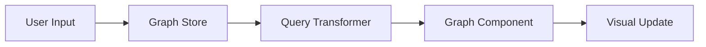
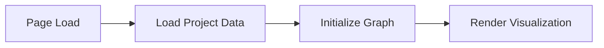

# Web Application Architecture Documentation

## Overview
This documentation outlines the structure and components of the web application, focusing on the knowledge graph visualization and project management features.

## Directory Structure

```
apps/web/src/
├── app/
│   └── (projects)/
│       └── projects/
│           └── [uuid]/
│               └── page.tsx         # Dynamic project page
├── components/
│   ├── knowledge-graph/
│   │   ├── Graph.tsx               # Main graph visualization
│   │   └── nodes/
│   │       └── BaseNode.tsx        # Base node component
│   │   └── edges/
│   │       └── BaseEdge.tsx        # Base edge component
│   ├── shared/
│   │   └── breadcrumbs/
│   │       └── BreadcrumbsContainer.tsx
│   └── ui/
│       ├── popover.tsx             # Reusable popover component
│       └── text-generate-effect.tsx # Text animation component
├── data/
│   └── summary.json                # Static data for graph
├── lib/
│   ├── query/
│   │   └── query-transformer.ts     # Query transformation logic
│   └── sample-graph-data.ts        # Sample graph data structure
└── store/
    └── graph-store.ts              # Global state management
```

## Key Components

### Project Page (`page.tsx`)
- Dynamic route handling for individual projects
- Manages project visualization state
- Integrates graph and location-based features

### Knowledge Graph Components

#### Graph.tsx
- Main visualization component
- Handles graph rendering and interactions
- Uses React Flow for graph visualization
- Manages node and edge relationships

#### BaseNode.tsx
- Base component for graph nodes
- Defines common node styling and behavior
- Handles node interactions and events

#### BaseEdge.tsx
- Base component for graph edges
- Defines common edge styling and behavior
- Handles edge interactions and events

### UI Components

#### Popover.tsx
- Reusable popover component
- Used for contextual information
- Built with Radix UI primitives

#### TextGenerateEffect.tsx
- Text animation component
- Provides dynamic text effects
- Used for loading and transition states

### Data Management

#### query-transformer.ts
- Transforms user queries into graph operations
- Handles query parsing and validation
- Maps queries to graph updates

#### sample-graph-data.ts
- Defines graph data structure
- Provides sample data for development
- Sets up node and edge type definitions

### State Management

#### graph-store.ts
- Global state management using Zustand
- Manages graph state and operations
- Handles user interactions and updates

## Data Flow

1. User Interaction


2. Data Loading


## Component Interactions

### Graph Visualization
- Graph.tsx serves as the container component
- BaseNode.tsx provides node templates
- BaseEdge.tsx provides edge templates
- Interactions are managed through graph-store.ts
- Queries are processed through query-transformer.ts

### Navigation
- BreadcrumbsContainer.tsx handles navigation context
- Dynamic routing through [uuid] folder structure
- Project-specific routing and state management

## State Management Strategy

The application uses Zustand for state management with the following structure:

```typescript
interface GraphState {
  nodes: Node[];
  edges: Edge[];
  selected: string | null;
  actions: {
    addNode: (node: Node) => void;
    updateEdge: (edge: Edge) => void;
    setSelected: (id: string | null) => void;
  };
}
```

## Performance Considerations

1. Lazy Loading
- Dynamic imports for heavy components
- Conditional rendering of graph elements

2. Optimization
- Memoized components
- Efficient state updates
- Batched graph operations

3. Data Management
- Cached query results
- Optimized data structures
- Incremental loading

## Future Improvements

1. Features
- [ ] Advanced search capabilities
- [ ] Custom node types
- [ ] Enhanced edge interactions
- [ ] Collaborative editing

2. Performance
- [ ] Virtual rendering for large graphs
- [ ] Worker-based calculations
- [ ] Optimized data structures

3. User Experience
- [ ] Improved navigation
- [ ] Better error handling
- [ ] Enhanced accessibility

## Development Guidelines

1. Component Creation
- Use functional components
- Implement proper TypeScript types
- Follow project naming conventions

2. State Management
- Keep state changes atomic
- Use proper action creators
- Maintain immutable updates

3. Styling
- Use Tailwind CSS
- Follow design system
- Maintain responsive design

## Testing Strategy

1. Component Testing
- Unit tests for isolated components
- Integration tests for connected features
- E2E tests for critical paths

2. State Testing
- Store action tests
- State transition tests
- Side effect handling

## Documentation Standards

1. Components
- Props documentation
- Usage examples
- Edge cases

2. Functions
- Input/output types
- Side effects
- Error handling

## Deployment Considerations

1. Build Process
- Optimize bundle size
- Handle environment variables
- Manage dependencies

2. Performance Monitoring
- Track key metrics
- Monitor error rates
- Analyze user interactions 